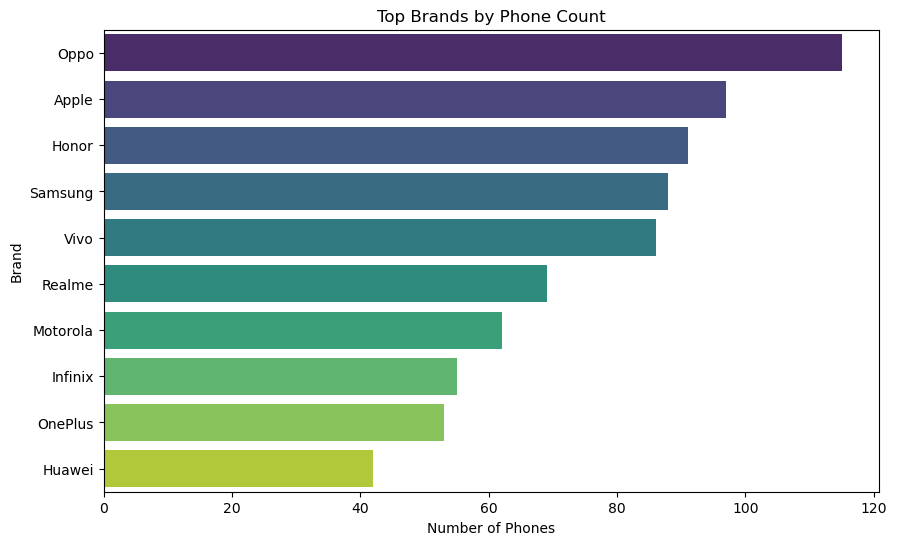

# Mobile Phone Market Analysis

## Overview
The goal of this project was to conduct a comprehensive analysis of a mobile phone dataset to uncover trends in pricing, technical specifications, and brand prevalence. This analysis aimed to deliver insights into how various features relate to price and popularity between different brands and across time.

## Technical Details
- **Programming Language:** Python
- **Libraries:** pandas, NumPy, Seaborn, Matplotlib, Regex
- **Environment:** Jupyter Notebook

## Data Source
- **[Mobiles Dataset (2025):](https://www.kaggle.com/datasets/abdulmalik1518/mobiles-dataset-2025/data)** A dataset from Kaggle that includes various specs for nearly 1,000 phone models released since 2014. This dataset was last updated in February 2025.

## Exploratory Data Analysis and Visualizations
The Jupyter notebook for this project can be found [here](Mobiles.ipynb).

### Data Cleaning and Preparation
- **Price Columns:** Removed currency symbols and converted to float.
- **RAM and Storage:** Standardized and converted units, including handling compound values and unit conversions (e.g., TB to GB).
- **Cameras:** Extracted numerical megapixel values and counted the number of lenses (e.g., single, dual, triple).
- **Screen Size & Battery:** Parsed and converted string formats to numeric types.
- **Model Name Cleanup:** Extracted storage-related substrings from model names and added to its own column for consistency.

This is the original dataset:

This is the data after cleaning and preparation:

---

### Analysis
The most prolific brands in the dataset were **Oppo**, **Apple**, **Honor**, and **Samsung**, based on the number of models released.

**Other Findings:**
- Most phones in the dataset had **64 or 128 GB** of **internal storage**.
- **Screen sizes** were predominantly between **6.0 and 6.7 inches**.
- **Screen size** was positively correlated with both **weight** and **battery capacity**.
- The **launch price** of phones in **Pakistan**, **India**, **China** and **Dubai** were highly correlated with one another, but were only moderately correlated with the **US prices**.

---

### Price Efficiency Metrics by Brand
- Several new columns were engineered to evaluate the **price-to-spec ratio**:
  - Price per GB of RAM
  - Price per GB of storage
  - Price per mAh of battery
  - Price per inch of screen size
  - Price per MP (front and back cameras)
- The **top ten phone brands** found previously were compared using these metrics.
- Grouped bar plots for each metric compared top brands:
  - **Infinix** and **Realme** offered competitive prices across multiple features.
  - **Apple**, **Huawei** and **Samsung** had higher price-per-spec values than their competitors. Customers are paying for the brand and software of these devices more than they are paying for the higher specs, especially in the case of Apple.

---

### Price Trends Over the Years
- Line plots showed how the **average price** and **price-to-feature ratios** evolved across **years**. Only the years 2020 to 2024 were evaluated as the previous years (and 2025) had significantly fewer entries in the dataset.
- **Average prices** for phones in the US **increased** over the years.
- The increase in **RAM**, **storage space**, and **battery capacity** outpaced the increased prices, thus resulting in newer models having a **higher price-per-spec ratio**.

